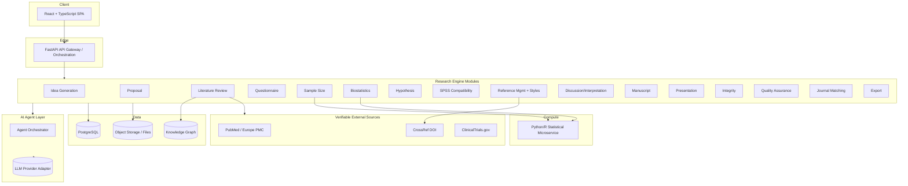
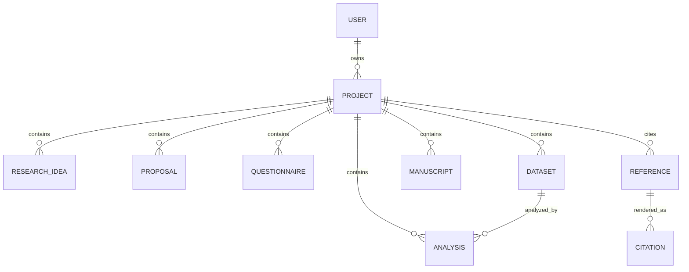

# OceanFloor Architecture

This document maps the **Medical Research Assistant™ (MRA)** master specification onto a concrete,
modular software architecture.

## 1. System overview

## 2. Engine → module mapping

| # | Specification engine | Backend module | Notes |
|---|----------------------|----------------|-------|
| 1 | Research Idea Generation | `app/engines/ideas` | LLM-assisted; ranks novelty/feasibility/impact |
| 2 | Research Proposal | `app/engines/proposals` | Structured section generator |
| 3 | Literature Review | `app/engines/literature` | Calls verifiable providers only |
| 4 | Questionnaire & Data Collection | `app/engines/questionnaires` | Exports REDCap/ODK/CSV |
| 5 | Sample Size | `app/engines/sample_size` | **Deterministic math** (no LLM) |
| 6 | Biostatistics | `app/engines/statistics` | Delegates to statistical microservice |
| 7 | Hypothesis | `app/engines/hypotheses` | Deterministic + test recommender |
| 8 | SPSS Compatibility | `app/engines/spss` | Data dictionary + syntax export |
| 9 | Reference Mgmt + Styles | `app/engines/references` | CSL-style formatting, DOI/PMID lookup |
| 10 | Discussion/Interpretation | `app/engines/discussion` | LLM-assisted narrative |
| 11 | Manuscript | `app/engines/manuscripts` | IMRAD assembly |
| 12 | Presentation | `app/engines/presentations` | Slide-deck JSON model |
| 13 | Integrity | `app/engines/integrity` | Similarity assessment, never "zero plagiarism" |
| 14 | Quality Assurance | `app/engines/quality` | Composite quality score |
| 15 | Journal Matching | `app/engines/journals` | Scope/IF matching |
| 16 | Export | `app/engines/export` | DOCX/PDF/PPTX/XLSX/CSV/MD/LaTeX/JSON |
| 17 | Knowledge Ocean Repository | `app/knowledge` | Indexed graph of concepts |

## 3. Service boundaries

- **backend (FastAPI, port 8000)** — Orchestrates engines, owns the relational data model,
  exposes a versioned REST API under `/api/v1`, and brokers calls to AI and statistical services.
- **statistical-service (FastAPI, port 8001)** — Stateless numeric compute. Heavy statistical and
  survival workloads (SciPy, statsmodels, lifelines) plus an optional R bridge (`rpy2`). Kept
  separate so it can scale independently and avoid blocking the API event loop.
- **frontend (Vite/React, port 5173)** — SPA. Talks only to the backend gateway.

## 4. Data model (core entities)

See [`backend/app/models`](../backend/app/models) for the SQLAlchemy definitions.

## 5. AI agent layer

The agent layer is **provider-agnostic**. `LLMProvider` is an abstract interface; concrete adapters
(OpenAI, Azure OpenAI, Anthropic, local) implement it. Engines never import a provider directly —
they request capabilities from the `AgentOrchestrator`, which selects a specialized agent
(`IdeationAgent`, `WritingAgent`, `MethodologyAgent`, …) and the configured provider.

Guardrails enforced at this layer:
- No fabricated references, citations, or DOIs.
- No clinical/diagnostic advice for individual patients.
- Always attribute sources surfaced by the literature engine.

## 6. Integrity & safety guarantees

- Reference/literature engines reject any record lacking a resolvable identifier.
- The integrity engine reports **similarity** and **attribution coverage**, and is contractually
  prevented from claiming guaranteed zero plagiarism.
- All AI output is labeled as requiring expert human verification.

## 7. Deployment

`docker-compose.yml` brings up `postgres`, `backend`, `statistical-service`, and `frontend`.
For production, each service is independently containerized and horizontally scalable; the
statistical service is the primary candidate for autoscaling under heavy analysis load.
